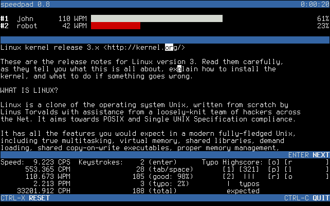
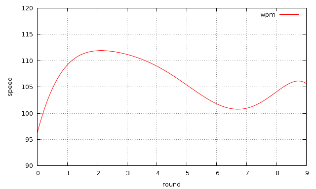
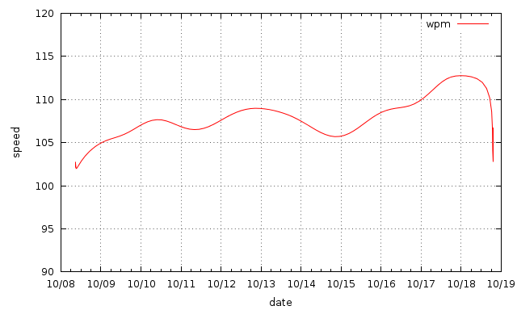
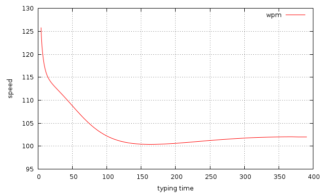
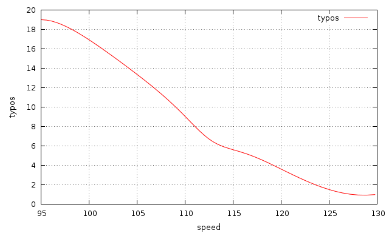

.. _screenshots:

***********
Screenshots
***********

Speedpad dumps stats in machine-readable format. This can be used to visualize
your progress using tools like ``gnuplot(1)``. You can append to a single
stats file to analyze your progress over multiple sessions, or merge multiple
stats dumps using something like ``sort -n stats1 stats2 stats3 > stats``.

The stats dump provides the following space-separated fields::

  started stopped elapsed len pos lines enter tab space good typo total cps cpm wpm ppm cph

Gnuplot examples
================

See `<http://www.gnuplot.info/>`_ for the full documentation.
Feel free to contribute more examples! :-)

Speed for all records
---------------------

::

  gnuplot -p -e "set xlabel 'round';
                 set ylabel 'speed';
                 set grid;
                 plot 'stats' using 15 smooth sbezier title 'wpm'"

Speed development over time
---------------------------

::

  gnuplot -p -e "set xdata time;
                 set timefmt '%s';
                 set format x '%m/%d';
                 set xlabel 'date';
                 set ylabel 'speed';
                 set grid;
                 plot 'stats' using 1:15 smooth sbezier title 'wpm'"

Speed in relation to elapsed typing time
----------------------------------------

::

  gnuplot -p -e "set xlabel 'typing time';
                 set ylabel 'speed';
                 set grid;
                 plot 'stats' using 3:15 smooth sbezier title 'wpm'"

Typos in relation to speed
--------------------------

::

  gnuplot -p -e "set xlabel 'speed';
                 set ylabel 'typos';
                 set grid;
                 plot 'stats' using 15:11 smooth sbezier title 'typos'"

